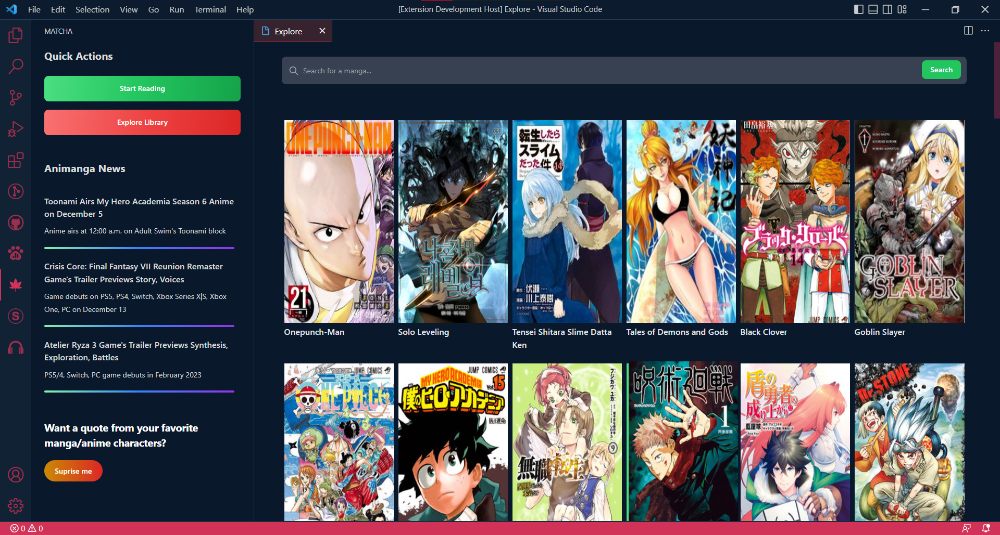

<h2 align="center" style="border-bottom: none">
    

    

    Matcha
</h2>

Read your favorite mangas through VSCode

 

 

## Features

- Browse and read your favorite mangas directly within Visual Studio Code.
- Stay up-to-date with the latest news related to anime and mangas
- Automatically tracks your manga reading history, so you can easily revisit recently read chapters.

## Preview

## Credits

This project wouldn't even be made without these fellas (really eased me as development would be much more complicated).

> https://consumet.org/ -> One of the most reliable manga scraping API available, proxying would be hard without this API :)

## License

Indicate the license under which your project is distributed. Choose an appropriate license that suits your project.

This project is licensed under the MIT License.
